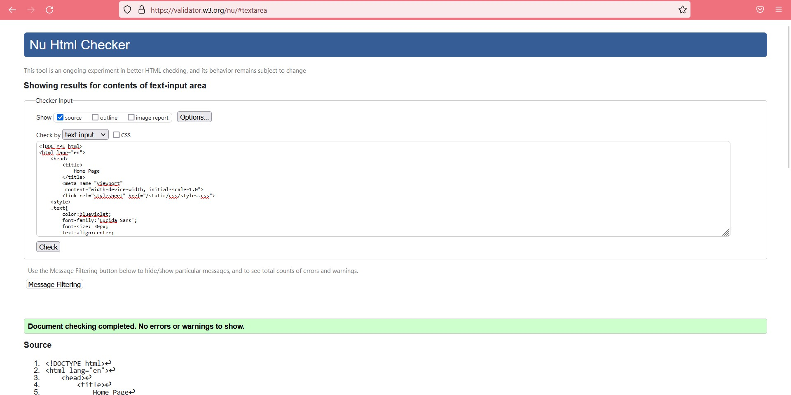
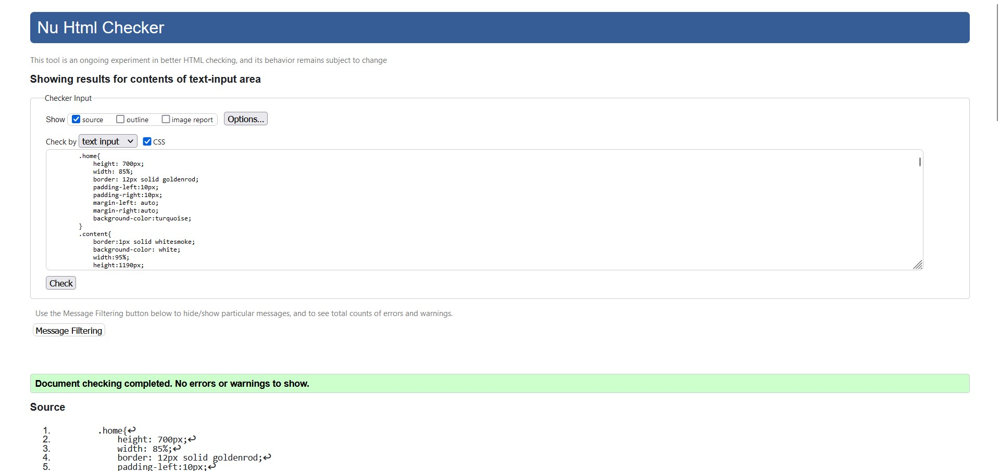

# Web Design for a Software Product Company

## AIM:

To design a static website for a software product company company.

## DESIGN STEPS:

### Step 1:

Requirement collection.

### Step 2:

Creating the layout using HTML and CSS.

### Step 3:

Updating the sample content.

### Step 4:

Choose the appropriate style and color scheme.

### Step 5:

Validate the layout in various browsers.

### Step 6:

Validate the HTML code.

### Step 6:

Publish the website in the given URL.

## PROGRAM :
### Home:
```<!DOCTYPE html>
<html lang="en">
    <head>
        <title>
            Home Page
        </title>
        <meta name="viewport" 
         content="width=device-width, initial-scale=1.0">
        <link rel="stylesheet" href="/static/css/styles.css">
    <style>
    .text{
        color:blueviolet;
        font-family:'Lucida Sans';
        font-size: 30px;
        text-align:left;
    }
    
    </style>

    </head>
    <body>
        <div class="home">
            <div class="header">
                <header>
                    <div class=logo></div>
                    <div class=h>
                    <a href="home.html" title="Home" style="color: blueviolet; text-decoration: none;"><b>Home</b></a></div>
                    <div class="prod">
                        <a href="products.html" title="Products" style="color: blueviolet; text-decoration: none;"><b>Products</b></a>
                    </div>
                    <div class="people">
                        <a href="people.html" title="People" style="color:blueviolet; text-decoration: none;"><b>People</b></a>
                    </div>
                    <div class="contact">
                        <a href="contact.html" title="Contact Us" style="color:blueviolet; text-decoration: none;"><b>Contact Us</b></a>
                    </div>
                </header>
                <div class="title">
                    <h1>Home</h1>
                </div><br>
                <div class="content">
         
                        <a href="contact.html" title="Contact Us"           </div>
                    <p>Medicine is the science and practice of caring for a patient, managing the diagnosis, prognosis, prevention, treatment, palliation of their injury or disease, and promoting their health</p>

                    <div style="text-align: center;color:violet;font-size:20px;"><b>Please use our services!</b></div>

                </div>
                <div class="footer">
                <footer style="color:white">
                Copyright &copy;2022 Developed by Jayachandran</footer></div>
            </div>
        </div>
    </body>
</html>
```
### Products:
```
<!DOCTYPE html>
<html lang="en">
    <head>
        <title>
            Products
        </title>
        <meta name="viewport" content="width=device-width, initial-scale=1.0">
        <link rel="stylesheet" href="/static/css/styles.css">
        <style>
        .home{
            height: 1050px;
            width: 85%;
            border: 12px solid goldenrod;
            padding-left:10px;
            padding-right:10px;
            margin-left: auto;
            margin-right:auto;
            background-color:salmon;
        }
        .text{
            color:blueviolet;
            font-family:'Lucida Sans';
            font-size: 30px;
            text-align:center;
        
        }
        .content{
            border:1px solid whitesmoke;
            background-color: white;
            width:95%;
            height:690px;
            padding:10px;
            margin-left:auto;
            margin-right:auto;
        }
        .ph1{
            background-image: url(/static/images/products/para.jpeg);
            background-size: 250px;
            background-position-x: center;
            background-repeat: no-repeat;
            border:1px solid black;
            height:200px;
            width:30%;
            position:relative;
            left: 50px;
        }
        .l1{
            color: gold;
            position:relative;
            right:380px;
            
            
        }
        .ph2{
            background-image: url(/static/images/products/crocin.jpeg);
            background-size: 250px;
            background-position-x: center;
            background-repeat: no-repeat;
            border:1px solid black;
            height:200px;
            width:30%;
            position:relative;
            left: 50px;
            
        }
        .l2{
            color: sandybrown;
            position:relative;
            right:380px;
        }
        .ph3{
            background-image: url(/static/images/products/cough.jpeg);
            background-size: 250px;
            background-position-x: center;
            background-repeat: no-repeat;
            border:1px solid black;
            height:200px;
            width:30%;
            position:relative;
            left: 700px;
            bottom:250px;
            
        }
        .l3{
            color: burlywood;
            position:relative;
            left:290px;
            bottom:240px;
        }
        .ph4{
            background-image: url(/static/images/products/dolo.webp);
            background-position-x: center;
            border:1px solid black;
            height:200px;
            width:30%;
            position:relative;
            left: 700px;
            bottom:760px;
            background-size: 310px;
            background-repeat: no-repeat;
            
            
        }
        .l4{
            color: burlywood;
            position:relative;
            left:270px;
            bottom: 750px;
        }

        .bot{
            text-align:center;
            font-size:larger;
            color:magenta;

        }
        </style>
    </head>
    <body>
        <div class="home">
            <div class="header">
                <header>
                    <div class=logo></div>
                    <div class=h>
                    <a href="home.html" title="Home" style="color: blueviolet; text-decoration: none;"><b>Home</a></div>
                    <div class="prod">
                        <a href="products.html" title="Products" style="color: blueviolet; text-decoration: none;"><b>Products</b></a>
                    </div>
                    <div class="people">
                        <a href="people.html" title="People" style="color:blueviolet; text-decoration: none;"><b>People</b></a>
                    </div>
                    <div class="contact">
                        <a href="contact.html" title="Contact Us" style="color:blueviolet; text-decoration: none;"><b>Contact Us</b></a>
                    </div>
                </header>
                <div class="title">
                    <h1>Products</h1>
                </div><br>
                <div class="content">
                    <div class="text">
                    <p>These are the products that are available now</p>
                    </div>
                    <div class="ph1"></div>
                    <div class="l1"><p align="center"><b>Paracetomal</b></p></div>
                    <div class="ph2"></div>
                    <div class="l2"><p align="center"><b>COugh Syrup</b></p></div>
                    <div class="ph3"></div>
                    <div class="l3"><p align="center"><b>Dolo 650 </b></p></div>
                    <div class="ph4"></div>
                    <div class="l4"><p align="center"><b>Crocin</b></p></div>
         
                </div>
                <div class="bot"><p>To Order Online: Call 95555 44444, 94444 55555</p></div>

                <div class="footer">
                <footer style="color:white">
                Copyright &copy;2022 Developed by Jeyachandran</footer></div>
            </div>
        </div>
    </body>
</html>
```
### People:
```
<!DOCTYPE html>
<html lang="en">
    <head>
        <title>
            People
        </title>
        <meta name="viewport" content="width=device-width, initial-scale=1.0">
        <link rel="stylesheet" href="/static/css/styles.css">
        <style>
        .home{
            height: 3000px;
            width: 85%;
            border: 12px solid goldenrod;
            padding-left:10px;
            padding-right:10px;
            margin-left: auto;
            margin-right:auto;
        }
        .text{
        color:blueviolet;
        font-family:'Lucida Sans';
        font-size: 30px;
        text-align:center;
        
        }
        .content{
            border:1px solid whitesmoke;
            background-color: white;
            width:95%;
            height:2690px;
            padding:10px;
            margin-left:auto;
            margin-right:auto;
        }
        .ceoph{
            background-image: url(/static/images/people/4.png);
            background-size: 250px;
            background-position-x: center;
            background-repeat: no-repeat;
            border:1px solid black;
            height:300px;
            width:20%;
            position:relative;
            left: 0px;
            margin-left:auto;
            margin-right: auto;
            
        }
        .ceo{
            color: gold;
            position:relative;
            text-align:center;
            
            
        }
        .manph1{
            background-image: url(/static/images/people/man1.jpg);
            background-size: 250px;
            background-position-x: center;
            background-repeat: no-repeat;
            border:1px solid black;
            height:300px;
            width:20%;
            position:relative;
            margin-left:auto;
            margin-right:auto;            
        }
        .man1{
            color: sandybrown;
            position:relative;
            text-align:center;
            
        }
        .manph2{
            background-image: url(/static/images/people/man2.jpg);
            background-size: 250px;
            background-position-x: center;
            background-repeat: no-repeat;
            border:1px solid black;
            height:300px;
            width:20%;
            position:relative;
            margin-left:auto;
            margin-right:auto;

            
        }
        .man2{
            color: burlywood;
            position:relative;
            text-align:center;
        }
        
        .amph1{
            background-image: url(/static/images/people/am1.jpg);
            background-size: 250px;
            background-position-x: center;
            background-repeat: no-repeat;
            border:1px solid black;
            height:300px;
            width:20%;
            position:relative;
            margin-left:auto;
            margin-right:auto;

            
        }
        .am1{
            color: burlywood;
            position:relative;
            text-align:center;
        }

        .amph2{
            background-image: url(/static/images/people/am2.jpg);
            background-size: 250px;
            background-position-x: center;
            background-repeat: no-repeat;
            border:1px solid black;
            height:220px;
            width:20%;
            position:relative;
            margin-left:auto;
            margin-right:auto;

            
        }
        .am2{
            color: burlywood;
            position:relative;
            text-align:center;
        }
        .amph3{
            background-image: url(/static/images/people/am3.jpg);
            background-size: 250px;
            background-position-x: center;
            background-repeat: no-repeat;
            border:1px solid black;
            height:250px;
            width:20%;
            position:relative;
            margin-left:auto;
            margin-right:auto;

            
        }
        .am3{
            color: burlywood;
            position:relative;
            text-align:center;
        }
        </style>
    </head>
    <body>
        <div class="home">
            <div class="header">
                <header>
                    <div class=logo></div>
                    <div class=h>
                    <a href="home.html" title="Home" style="color: blueviolet; text-decoration: none;"><b>Home</b></a></div>
                    <div class="prod">
                        <a href="products.html" title="Products" style="color: blueviolet; text-decoration: none;"><b>Products</b></a>
                    </div>
                    <div class="people">
                        <a href="people.html" title="People" style="color:blueviolet; text-decoration: none;"><b>People</b></a>
                    </div>
                    <div class="contact">
                        <a href="contact.html" title="Contact Us" style="color:blueviolet; text-decoration: none;"><b>Contact Us</b></a>
                    </div>
                </header>
                <div class="title">
                    <h1>People</h1>
                </div><br>
                <div class="content">
                    <div class="text">
                    <p>These are the people who are associated with Us</p>
                    <h4><u>CEO/Owner</u></h4>
                    </div>
                    <div class="ceoph"></div>
                    <div class="ceo"><p align="center"><b><h2>Elon Musk</h2></b></div>
                    <br>
                    <div class="text">
                        <p><b><u>Managers</u></b></p><br>
                    </div>
                    <div class="manph1"></div>
                    <div class="man1"><p align="center"><b><h2>The Rock</h2></b></p></div>
                    <div class="manph2"></div>
                    <div class="man2"><p><b><h2>Robert</h2></b></p></div>
                    <br>
                    <div class="text"><p><b><u>Asst. Managers</u></b></p></div><br>
                    <div class="amph1"></div>
                    <div class="am1"><p align="center"><b><h2>Johnny Depp</h2></b></p></div>
                    <div class="amph2"></div>
                    <div class="am2"><p align="center"><b><h2>Steve Jobs</h2></b></p></div>
                    <div class="amph3"></div>
                    <div class="am3"><p align="center"><b><h2>Mark Zuckerberg</h2></b></p></div><br>
                    <div class="text">Thank you for working with us!<br> Expecting your forever support!</div>
                </div>
                <div class="footer">
                <footer style="color:white">
                Copyright &copy;2022 Developed by Jeyachandran</footer></div>
            </div>
        </div>
    </body>
</html>
```
### Contact us:
```
<!DOCTYPE html>
<html lang="en">
    <head>
        <title>
            Contact Us
        </title>
        <meta name="viewport" 
         content="width=device-width, initial-scale=1.0">
        <link rel="stylesheet" href="/static/css/styles.css">
    <style>
    .text{
        color:blueviolet;
        font-family:'Lucida Sans';
        font-size: 30px;
        text-align:center;
    }
    
    </style>

    </head>
    <body>
        <div class="home">
            <div class="header">
                <header>
                    <div class=logo></div>
                    <div class=h>
                    <a href="home.html" title="Home" style="color: blueviolet; text-decoration: none;"><b>Home</b></a></div>
                    <div class="prod">
                        <a href="products.html" title="Products" style="color: blueviolet; text-decoration: none;"><b>Products</b></a>
                    </div>
                    <div class="people">
                        <a href="people.html" title="People" style="color:blueviolet; text-decoration: none;"><b>People</b></a>
                    </div>
                    <div class="contact">
                        <a href="contact.html" title="Contact Us" style="color:blueviolet; text-decoration: none;"><b>Contact Us</b></a>
                    </div>
                </header>
                <div class="title">
                    <h1>Contact Us</h1>
                </div><br>
                <div class="content">
                    <div class="text">
                    <p><b>Here are the details about us
                    <h5>Do contact us for any need</h5></b></p>
                    
                    </div>
                    <b><h2>Contact Information:</h2></b>
                    <p><b>&emsp;&ensp;Address:</b>
                         Saveetha Nagar, Sriperumbadur Taluk, Kanchipuram - Chennai Rd, Chennai, Tamil Nadu 602105
                    </p>
                    <ul>
                        <li><b>Mobile: 9555544444</b></li>
                        <li><b>Alternate Mobile Number</b>: 9444455555</li>
                        <li><b>Alternate Mobile Number:</b> 8957425552</li>
                        <li><b>Email Id:</b> medicalstore11@gmail.com</li>
                        <li><b>Fax:</b> 22552551</li>
                    </ul>
                    <div style="text-align: center;color:violet;font-size:20px;"><b>Please use our services!</b></div>

                </div>
                <div class="footer">
                <footer style="color:white">
                Copyright &copy;2022 Developed by Jeyachandran</footer></div>
            </div>
        </div>
    </body>
</html>
```
### views
```
from django.shortcuts import render


def company(request):
    return render (request,"home.html")

def products(request):
    return render(request,"products.html")

def people(request):
    return render(request,"people.html")

def contact(request):
    return render (request,"contact.html")
```
### urls:
```
from django.contrib import admin
from django.urls import path

from website import views
urlpatterns = [
    path('admin/', admin.site.urls),
    path('',views.company,name="company"),
    path("products.html",views.products,name='products'),
    path("home.html", views.company),
    path("people.html",views.people),
    path("contact.html",views.contact),
]
```

## OUTPUT:

### Home Page:

### Products Page:

### People Page:

### Contact us Page:

## Verification:
### HTML:

### CSS:


## Result:

Thus a website is designed for the software product company and the HTML,CSS code are validated.
